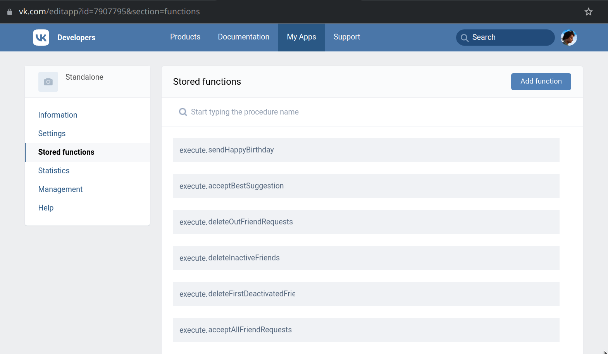

# VK Backend Application

This is a backend application for VK. It contains stored functions for VK Automation to work.

# Setup

1. These scripts should be set up via https://vk.com/apps?act=manage to be usable

